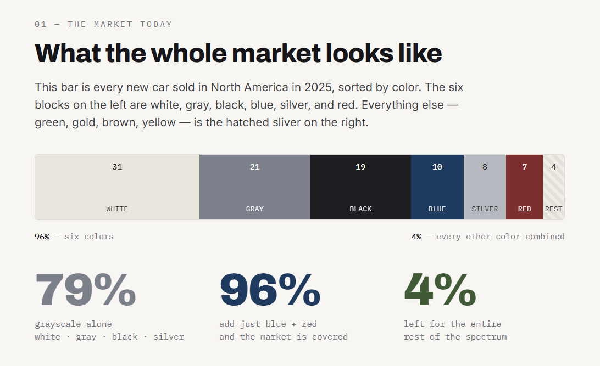

# How American Cars Lost Their Color

A data essay on how six colors came to cover **96% of new cars** sold in North America in 2025 — and why even the two "colorful" exceptions, blue and red, have become the darkest, most restrained versions of themselves.

**[▶ View the live site](#)** · _(add your deployed URL here — e.g. GitHub Pages / Netlify / Vercel)_

---

## Screenshot



---

## Key findings

- **79%** of 2025 new cars in North America were grayscale — white, gray, black, or silver.
- Adding just **blue and red** brings the total to **96%**: six colors cover nearly the entire market.
- The remaining **4%** is left for the entire rest of the spectrum (green, gold, brown, yellow).
- Even the exceptions hide: the popular blue is **navy**, and the popular red is a **deep, muted** tone — the whole market has converged on restraint.
- This wasn't always true. Grayscale was roughly a **sixth** of the market in the mid-1970s and only crossed the 50% line in the **1990s**.

---

## How this was made

The research, data analysis, and initial build for this project were carried out with **Claude (Anthropic)**. Claude gathered the figures from industry color-popularity reports, structured the historical trend, built the interactive visualizations, and logged every assumption. The full methodology and assumptions are documented in the site's "Methodology & assumptions" section.

The original hypothesis — that modern cars have collapsed to a handful of colors, and that even the "color" cars skew dark — was the starting point that drove the investigation.

> **On the AI's role:** Claude was the instrument for the data work and the build. The analysis, framing, and interpretation below are mine.

---

## My analysis

This was just a curiosity project and I had AI run the analysis and create the website. I was curious the extent to which the colors of our cars in the US have changed over the past half-century. It's no secret that there's a wild car dependence in the US - starting in the 1950s when the highway system was built, coinciding with the move of white people to the suburbs (where there is no public transportation), nearly all Americans need a car (unless you live in NYC or a select few cities). There's a freedom aspect to it: with a car you can go nearly anywhere at any time without needing to wait for a restrictive bus. However, this argument has somewhat turned on its head as the requirement to have a car now means you have no other real means of transportation for food and entertainment other than a car.

When car culture first started - say in the 1960s/1970s, cars were also a show of personality. The brand and model mattered, people obsessed over the difference between a Ford and a Toyota (or even a Ford and a Chevy), and the different car manufacturers had markedly different vehicles.

Now, not only do the different manufacturers make more-or-less the same car, the colors have been standardized to such an extent that a time traveler from the 1970s would be shocked to see the roads today. From just my own observation, I noticed that every time you see a mass of cars together (a highway, major parking lot, etc...), you see all the same colors: white, gray/silver, black, and then a dark blue and a dark red. That's it. Sparingly you'll see a dark green, but almost never a light green. Same with brown, and yellow is incredibly rare.

The analysis run by Claude supports this theory to even more of a degree than I had expected. In 2025, according to KBB and Axalta, nearly 80% of cars now are a grayscale shade (black, gray, silver, white). And if you add in that dark blue and red, 96% of cars fit into those 6 colors. That's honestly even more than I would've expected, even though if you look at just about any road or parking lot, at least 9 out of every 10 cars are one of those six colors.

Then if you look at the data from the 1970s (which is approximate because they weren't storing the data the same way back then), only about 20-25% of cars were grayscale. That's an unbelievable amount of growth away from creativity in 50 years. In the 1970s, blue and red were the most popular colors, but that covered a range of blues and reds (not only the predominantly dark blue and dark red which appear today). 

At a time when nearly every American staple chain (ex. McDonalds, Starbucks, Taco Bell, etc...) has gone from fun and exciting layouts to drab black-and-white monotone dystopian-looking buildings, it's unsurprising that cars would follow the same trend. But the extent to which it has happened is quite shocking.

---

## Data sources

| Source | Used for |
| --- | --- |
| Axalta — 2025 Global Automotive Color Popularity Report (73rd ed.) | Exact 2025 North America breakdown |
| PPG — History of Automotive Colors | Historical trend, green's 1990s peak |
| Kelley Blue Book — A History of Automotive Paint Colors | Decade-by-decade context |
| iSeeCars — 22-million-vehicle color study | Modern grayscale dominance |
| Curbside Classic — "Fade to Gray" | Registration-based long-run analysis |

**A note on precision:** the 2025 figures are exact. The pre-2000 decade numbers are directional estimates stitched from secondary sources — see assumption **A3** on the site. The "muted red" observation is interpretation, not a measured figure (assumption **A4**).

---

## Running it locally

The site is plain HTML, CSS, and JavaScript with no build step. Because `index.html` links `styles.css` and `script.js` as separate files, open it through a local server rather than double-clicking the file:

```bash
# from inside the project folder
python3 -m http.server 8000
# then visit http://localhost:8000
```

Any static host (GitHub Pages, Netlify, Vercel) will serve the folder as-is with zero configuration.

## Project structure

```
car-color-convergence/
├── index.html    # structure and content
├── styles.css    # all styling; palette variables at the top
├── script.js     # interactions; source data in constants at the top
└── README.md
```

To update next year's numbers, edit `WALL_DATA` at the top of `script.js` — the data is deliberately separated from the rendering logic.

---

## Possible next steps

The muted-red claim is the analysis's weakest-sourced point. To make it quantitative, the move is to pull **shade-level** data from used-car listings or registration datasets (some tag specific paint names) and count "navy/midnight" vs "electric/bright" blue directly — turning the observation into a measured finding.

---

_Built with Claude (Anthropic). Reuse freely with attribution._